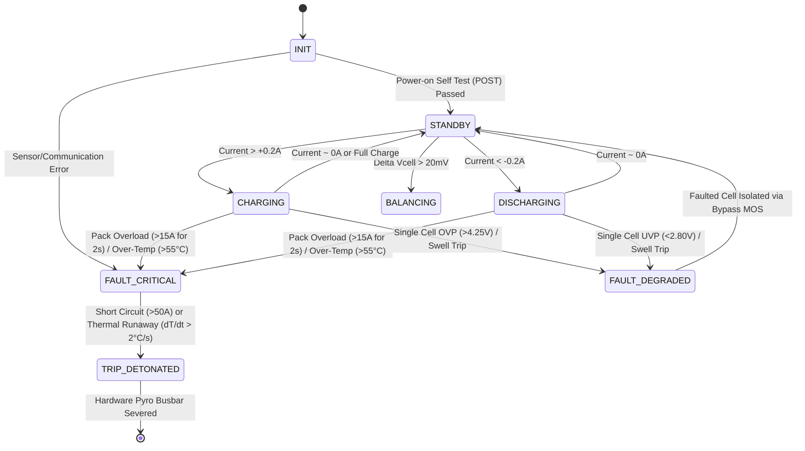

# System Architecture

## 1. Overview
The ESP32-S3 Smart Battery Management System (BMS) provides real-time multi-cell monitoring, proactive single-cell bypass fault isolation, sub-millisecond emergency pyro-fuse tripping, TinyML health estimation, and live ASCII telemetry.

```
                  +----------------------------------------------+
                  |               ESP32-S3 MCU                   |
                  |  - Dual Core 240MHz + 16MB Flash + 8MB PSRAM |
                  +----------------------------------------------+
                           |           |               |
              +------------+           |               +---------------+
              | I2C                    | SPI                           | GPIO / PWM
              v                        v                               v
    +-------------------+    +---------------------+        +--------------------+
    | ADS1115 16-Bit    |    | Winbond W25Q128JV   |        | WS2812B RGB LEDs   |
    | Precision ADC     |    | SPI NOR Flash       |        | (Per-cell status)  |
    +-------------------+    +---------------------+        +--------------------+
              |
              +--> [Cell 1..4 Voltage Sensing]
    
    Analog/Digital GPIO:
    - Current: ACS724 Hall Sensor (±50A bi-directional)
    - Temp: 4x NTC 10K Thermistors + 1x Ambient
    - Pressure: 4x Interlink FSR 402 Swelling Sensors
    - Bypass Drivers: 4x IRF4905 / IRLB8721 MOSFET pairs
    - Emergency Cutoff: BT151 SCR + 4700µF Cap Bank -> Littelfuse Pyro-Fuse
```

## 2. Finite State Machine (FSM)


