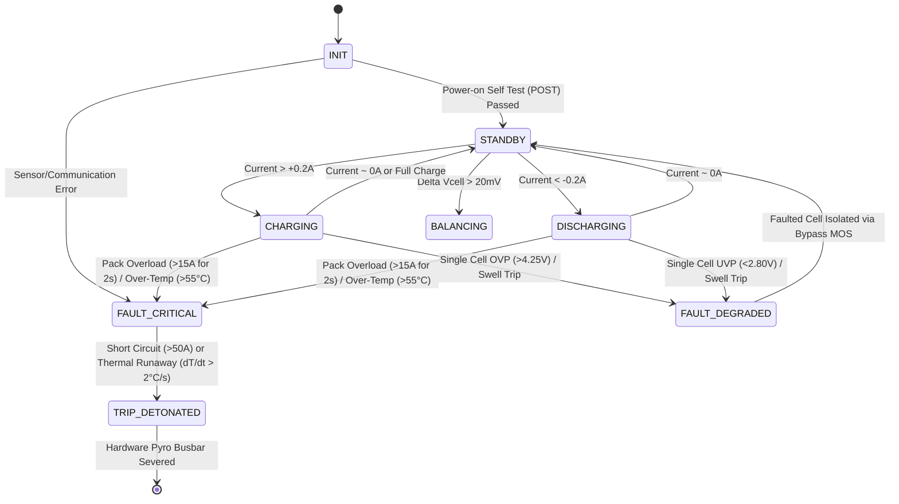

# System Architecture

## 1. Overview
The ESP32-S3 Smart Battery Management System (BMS) provides real-time multi-cell monitoring, proactive single-cell bypass fault isolation, sub-millisecond emergency pyro-fuse tripping, TinyML health estimation, and live ASCII telemetry.

```
                  +----------------------------------------------+
                  |               ESP32-S3 MCU                   |
                  |  - Dual Core 240MHz + 16MB Flash + 8MB PSRAM |
                  +----------------------------------------------+
                           |           |               |
              +------------+           |               +---------------+
              | I2C                    | SPI                           | GPIO / PWM
              v                        v                               v
    +-------------------+    +---------------------+        +--------------------+
    | ADS1115 16-Bit    |    | Winbond W25Q128JV   |        | WS2812B RGB LEDs   |
    | Precision ADC     |    | SPI NOR Flash       |        | (Per-cell status)  |
    +-------------------+    +---------------------+        +--------------------+
              |
              +--> [Cell 1..4 Voltage Sensing]
    
    Analog/Digital GPIO:
    - Current: ACS724 Hall Sensor (±50A bi-directional)
    - Temp: 4x NTC 10K Thermistors + 1x Ambient
    - Pressure: 4x Interlink FSR 402 Swelling Sensors
    - Bypass Drivers: 4x IRF4905 / IRLB8721 MOSFET pairs
    - Emergency Cutoff: BT151 SCR + 4700µF Cap Bank -> Littelfuse Pyro-Fuse
```

## 2. Finite State Machine (FSM)




## 3. Core Type Hierarchy & Safety Invariants

The firmware canonical vocabulary and data structures are defined in [`include/firmware/core/types.hpp`](../include/firmware/core/types.hpp):

- **State & Health Enums**:
  - `BmsState` (`uint8_t`): 8 system execution states (`INIT`, `STANDBY`, `CHARGING`, `DISCHARGING`, `BALANCING`, `FAULT_DEGRADED`, `FAULT_CRITICAL`, `TRIP_DETONATED`).
  - `CellStatus` (`uint8_t`): Per-cell statuses (`ACTIVE`, `BALANCING`, `BYPASSED`, `SWELLING_WARN`, `FAULTED`).
- **Fault Tracking**:
  - `FaultCode` (`uint16_t`): Bitmask-compatible protection error flags (`OVP`, `UVP`, `OCP_CHARGE`, `OCP_DISCHARGE`, `OTC`, `UTC`, `SHORT_CIRCUIT`, `THERMAL_RUNAWAY`, `SWELLING_CRITICAL`, `COMM_TIMEOUT`).
  - `FaultMask`: Strongly typed bitfield wrapper managing error sets with bitwise operators and `__builtin_popcount`.
- **Pyrotechnic Safety Interlock**:
  - `PyroTriggerKey`: Two-stage arm+fire protocol with high Hamming-distance tokens (`0x5A5AA5A5`, `0xC3C33C3C`) and a 50ms confirmation window to prevent inadvertent firing from memory corruption or software state glitches.
- **Canonical Telemetry Structures**:
  - `CellMetrics` & `PackMetrics`: Standard layout, trivially copyable POD structures with monotonic timestamps, `ValidityMask` freshness flags, and trailing `crc16` (CRC-16-CCITT) checksums for deterministic FreeRTOS inter-task communication.

## 4. Software Architecture: "Nouns vs. Verbs"

The firmware enforces strict decoupling between pure data contracts (Header-Only blueprints) and OOP application business logic:

```
include/modules/   --> THE NOUNS (Pure Data / Register Maps / POD Telemetry / Headers Only)
    ├── types/     --> Canonical enums, bitmasks, safety keys, telemetry PODs
    └── drivers/   --> Hardware peripheral register structs and raw data packets

include/firmware/  --> THE VERBS: Application Layer (OOP Classes & Declarations)
    ├── config/    --> System pins, threshold limits, timing configs
    ├── drivers/   --> Peripheral driver classes (holds module struct privately)
    ├── core/      --> BatteryPack, Cell, Protection, Balancing, StateMachine
    ├── algorithms/--> SoC, SoH, SoP, TinyML Anomaly Detector
    ├── tasks/     --> FreeRTOS task headers & synchronization queues
    └── utils/     --> Filters, RingBuffers, Time utilities, Logger

src/firmware/      --> IMPLEMENTATION LAYER (.cpp definitions)
    ├── drivers/   --> Driver implementations
    ├── core/      --> Core business logic implementations
    ├── algorithms/--> Estimation algorithms & mathematical solvers
    ├── tasks/     --> FreeRTOS task infinite loops & core pinning
    └── utils/     --> Utility implementations
```


