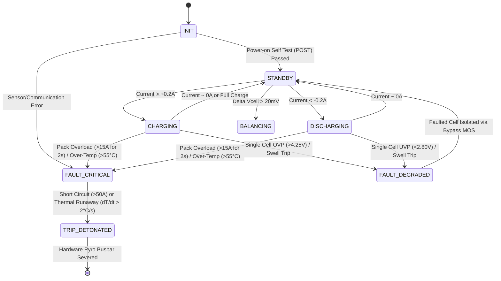

# System Architecture

## 1. Overview
The ESP32-S3 Smart Battery Management System (BMS) provides real-time multi-cell monitoring, proactive single-cell bypass fault isolation, sub-millisecond emergency pyro-fuse tripping, TinyML health estimation, and live ASCII telemetry.
```
+----------------------------------------------+
              |               ESP32-S3 MCU                   |
              |  - Dual Core 240MHz + 16MB Flash + 8MB PSRAM |
              +----------------------------------------------+
                       |           |               |
          +------------+           |               +---------------+
          | I2C                    | SPI                           | GPIO / PWM
          v                        v                               v
+-------------------+    +---------------------+        +--------------------+
| ADS1115 16-Bit    |    | Winbond W25Q128JV   |        | WS2812B RGB LEDs   |
| Precision ADC     |    | SPI NOR Flash       |        | (Per-cell status)  |
+-------------------+    +---------------------+        +--------------------+
          |
          +--> [Cell 1..4 Voltage Sensing]

Analog/Digital GPIO:
- Current: ACS724 Hall Sensor (±50A bi-directional)
- Temp: 4x NTC 10K Thermistors + 1x Ambient
- Pressure: 4x Interlink FSR 402 Swelling Sensors
- Bypass Drivers: 4x IRF4905 / IRLB8721 MOSFET pairs
- Emergency Cutoff: BT151 SCR + 4700µF Cap Bank -> Littelfuse Pyro-Fuse
```

## 2. Finite State Machine (FSM)


```mermaid
stateDiagram-v2
    [*] --> INIT
    INIT --> STANDBY: Power-on Self Test (POST) Passed
    INIT --> FAULT_CRITICAL: Sensor/Communication Error

    STANDBY --> CHARGING: Current > +0.2A
    STANDBY --> DISCHARGING: Current < -0.2A
    STANDBY --> BALANCING: Delta Vcell > 20mV

    CHARGING --> STANDBY: Current ~ 0A or Full Charge
    DISCHARGING --> STANDBY: Current ~ 0A

    CHARGING --> FAULT_DEGRADED: Single Cell OVP (>4.25V) / Swell Trip
    DISCHARGING --> FAULT_DEGRADED: Single Cell UVP (<2.80V) / Swell Trip
    
    FAULT_DEGRADED --> STANDBY: Faulted Cell Isolated via Bypass MOS

    CHARGING --> FAULT_CRITICAL: Pack Overload (>15A for 2s) / Over-Temp (>55°C)
    DISCHARGING --> FAULT_CRITICAL: Pack Overload (>15A for 2s) / Over-Temp (>55°C)
    
    FAULT_CRITICAL --> TRIP_DETONATED: Short Circuit (>50A) or Thermal Runaway (dT/dt > 2°C/s)
    TRIP_DETONATED --> [*]: Hardware Pyro Busbar Severed
```


## 3. Core Type Hierarchy & Safety Invariants

The firmware canonical vocabulary and data structures are defined in [`include/modules/types`](../include/modules/types/):

- **State & Health Enums**:
  - `BmsState` (`uint8_t`): 8 system execution states (`INIT`, `STANDBY`, `CHARGING`, `DISCHARGING`, `BALANCING`, `FAULT_DEGRADED`, `FAULT_CRITICAL`, `TRIP_DETONATED`).
  - `CellStatus` (`uint8_t`): Per-cell statuses (`ACTIVE`, `BALANCING`, `BYPASSED`, `SWELLING_WARN`, `FAULTED`).
- **Fault Tracking**:
  - `FaultCode` (`uint16_t`): Bitmask-compatible protection error flags (`OVP`, `UVP`, `OCP_CHARGE`, `OCP_DISCHARGE`, `OTC`, `UTC`, `SHORT_CIRCUIT`, `THERMAL_RUNAWAY`, `SWELLING_CRITICAL`, `COMM_TIMEOUT`).
  - `FaultMask`: Strongly typed bitfield wrapper managing error sets with bitwise operators and `__builtin_popcount`.
- **Pyrotechnic Safety Interlock**:
  - `PyroTriggerKey`: Two-stage arm+fire protocol with high Hamming-distance tokens (`0x5A5AA5A5`, `0xC3C33C3C`) and a 50ms confirmation window to prevent inadvertent firing from memory corruption or software state glitches.
- **Canonical Telemetry Structures**:
  - `CellMetrics` & `PackMetrics`: Standard layout, trivially copyable POD structures with monotonic timestamps, `ValidityMask` freshness flags, and trailing `crc16` (CRC-16-CCITT) checksums for deterministic FreeRTOS inter-task communication.

## 4. Software Architecture: "Nouns vs. Verbs"

The firmware enforces strict decoupling between pure data contracts (Header-Only blueprints) and OOP application business logic:

```
include/modules/   --> THE NOUNS (Pure Data / Register Maps / POD Telemetry / Headers Only)
    ├── types/     --> Canonical enums, bitmasks, safety keys, telemetry PODs
    └── drivers/   --> Hardware peripheral register structs and raw data packets

include/firmware/  --> THE VERBS: Application Layer (OOP Classes & Declarations)
    ├── config/    --> System pins, threshold limits, timing configs
    ├── drivers/   --> Peripheral driver classes (holds module struct privately)
    ├── core/      --> BatteryPack, Cell, Protection, Balancing, StateMachine
    ├── algorithms/--> SoC, SoH, SoP, TinyML Anomaly Detector
    ├── tasks/     --> FreeRTOS task headers & synchronization queues
    └── utils/     --> Filters, RingBuffers, Time utilities, Logger

src/firmware/      --> IMPLEMENTATION LAYER (.cpp definitions)
    ├── drivers/   --> Driver implementations
    ├── core/      --> Core business logic implementations
    ├── algorithms/--> Estimation algorithms & mathematical solvers
    ├── tasks/     --> FreeRTOS task infinite loops & core pinning
    └── utils/     --> Utility implementations
```

## 5. Black-Box Flight Recorder & SPI Flash Subsystem (W25Q128JV)

The BMS incorporates an aerospace-grade "black box" flight data recorder implemented on a 128Mb (16MB) external Winbond W25Q128JV SPI NOR Flash. It provides deterministic, crash-resilient telemetry persistence with non-volatile evidence freezing.

### 5.1 Flash Memory Partition Map

The 16MB address space (4,096 sectors of 4KB each, 256 bytes per page) is partitioned into functional zones:

| Sector Range | Address Range | Size | Function / Description |
| :--- | :--- | :--- | :--- |
| **0 .. 3** | `0x000000` - `0x003FFF` | 16 KB | Reserved (Bootloader, Partition Table, NVS, OTA scratch) |
| **4 .. 4093** | `0x004000` - `0x0FFDFFF` | 16,360 KB | Circular Ring Buffer for `FlightRecord` entries (261,760 records) |
| **4094** | `0x0FFE000` - `0x0FFEFFF` | 4 KB | Persistent `FreezeMarker` metadata (evidence freeze lock) |
| **4095** | `0x0FFF000` - `0x0FFFFFF` | 4 KB | Persistent `LifetimeStatsRecord` aggregate wear & cycle stats |

### 5.2 Flight Record Schema & Data Alignment

- **Record Packing**: Each `FlightRecord` is strictly 64 bytes (`alignas(64)`), containing monotonic timestamps, boot epoch counters, 4-cell voltage telemetry, pack current, thermistor array, casing swelling forces, active bypass masks, fault flags, SOC estimation, and trailing CRC32.
- **Physical Packing**:
  - Exactly **4 records per 256-byte page** (no record crosses a page boundary).
  - Exactly **64 records per 4KB sector**.
  - Total capacity: $4,090 \text{ sectors} \times 64 \text{ records/sector} = 261,760 \text{ records}$ (~7.2 hours of continuous 10Hz flight history).
- **Integrity Verification**: IEEE 802.3 CRC32 (`0xEDB88320`) computed over bytes `[0 .. offsetof(crc32)]`. Corrupted or incomplete records fail CRC verification and are ignored or rejected.

### 5.3 Low-Latency Fault Flush & Erase-Suspend Protocol

During normal operation, flight telemetry is sampled at 10Hz and queued. Page programming occurs once 4 records accumulate in RAM (256 bytes).

```
   Normal 10Hz Log Queue                  Critical Fault Event
            │                                      │
            ▼                                      ▼
   Accumulate 4 Records                  Queue Drain & Flush All
            │                                      │
            ▼                                      ▼
   Page Program (256B)               Is Background Erase Active?
                                            ├── Yes ──► Issue 0x75 (Erase Suspend)
                                            │           Poll WIP==0 (<20µs)
                                            │           Program Fault Page
                                            │           Issue 0x7A (Erase Resume)
                                            └── No  ──► Direct Page Program
```

When an emergency fault occurs (`OVP`, `UVP`, `OCP`, `SHORT_CIRCUIT`, `THERMAL_RUNAWAY`):
1. **Immediate Queue Drain**: All pending records in the FreeRTOS telemetry queue are drained into the active page buffer.
2. **Erase-Suspend Handling**: If a background sector erase (which takes 400ms - 1000ms) is active on the SPI bus:
   - The driver issues `0x75` (`W25Q_CMD_ERASE_SUSPEND`).
   - Polls Status Register 1 until `WIP == 0` (typically $\le 20\mu\text{s}$).
   - Programs the fault page to a clean pre-erased sector.
   - Verifies the written record via readback (with automatic slot progression retry on failure).
   - Issues `0x7A` (`W25Q_CMD_ERASE_RESUME`) to resume the sector erase without blocking emergency shutdown.

### 5.4 Persistent Crash Evidence Freeze

For permanent and catastrophic safety shutdowns (e.g. `SHORT_CIRCUIT`, `THERMAL_RUNAWAY`, `SWELLING_CRITICAL`, or manual Pyro-Fuse trigger):
- The `FlashLogger` commits a `FreezeMarker` to reserved Sector 4094.
- The marker persists the frozen sector range (up to 16 sectors / 1,024 records immediately preceding and during the incident), the critical sequence ID, and boot counter.
- **Ring Invariant**: The circular logging head is forbidden from entering the frozen range. Both `reclaim_sector()` and bulk `erase_all_logs()` protect the frozen sectors.
- **Reboot Resilience**: The freeze marker is discovered during boot initialization, locking the evidence until cleared via an authorized diagnostic command (`clear_freeze()`).

### 5.5 Fast Two-Tier Boot Recovery Scan

On power-up or post-crash reboot:
1. **Tier 1 (Sector Head Discovery)**: Scans Page 0 of all logging sectors ($4..4093$) via high-speed SPI DMA (~16ms total). Reads sequence IDs and boot counts to identify the highest active sequence and find sector discontinuities.
2. **Tier 2 (Record Binary Search)**: Executes a binary search inside the active head sector ($O(\log_2 64) = 6$ page reads) to locate the precise unwritten boundary (`0xFF` erased space).
3. **Pre-Erase Wear Leveling**: Evaluates erased sector headroom and asynchronously pre-erases 4 sectors ahead of the write head to prevent runtime write stalls.


